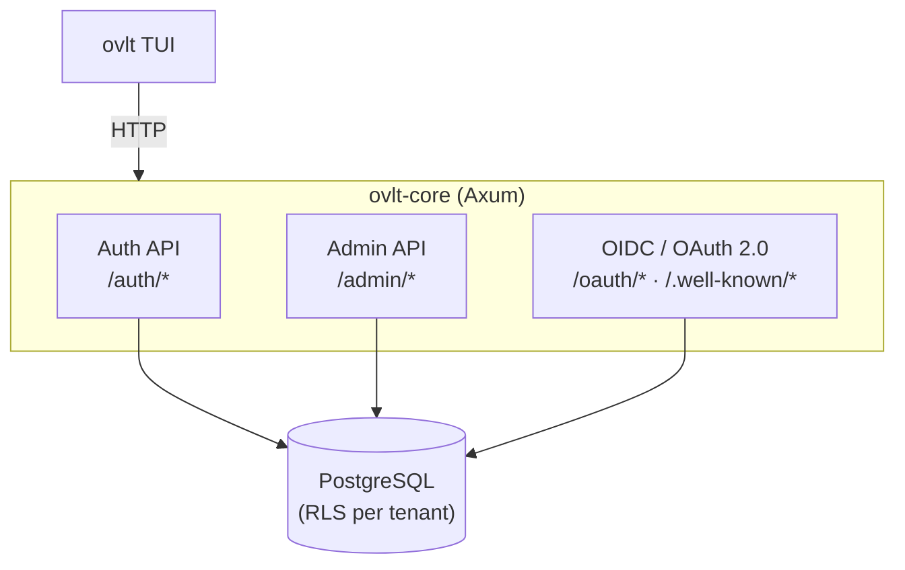
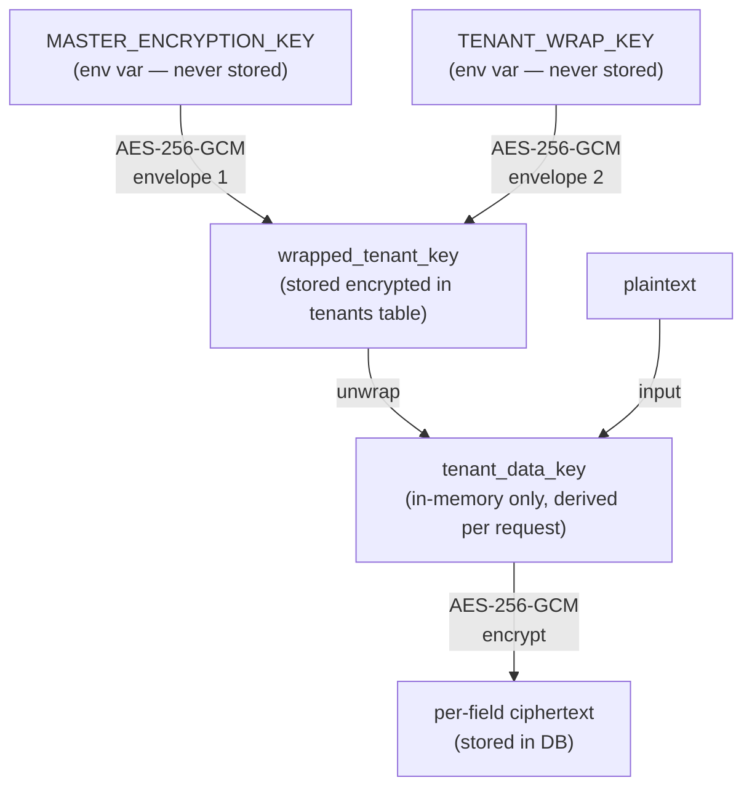
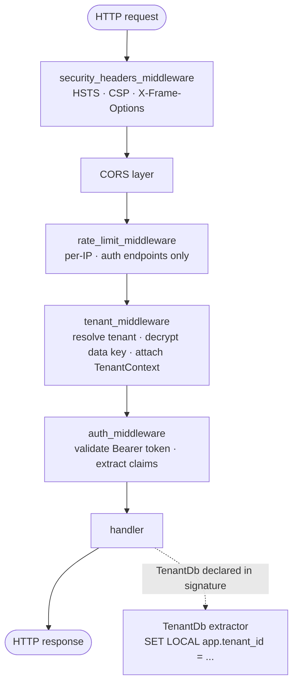

## Overview

OVLT is a single Rust binary (`ovlt-core`) built on Axum. It exposes three logical API surfaces over one HTTP server:



## Multi-tenancy

Each tenant is a row in the `tenants` table. Every data table (`users`, `clients`, `roles`, `sessions`, etc.) has a `tenant_id` column.

**PostgreSQL Row-Level Security (RLS)** enforces isolation at the database level, not the application level:

```mermaid
sequenceDiagram
    participant MW as tenant_middleware
    participant H as handler
    participant DB as PostgreSQL (ovlt_rls role)
    participant RLS as RLS policy

    MW->>MW: resolve tenant from header<br/>decrypt tenant data key<br/>store TenantContext in request extensions
    MW->>H: forward request
    H->>DB: db::begin_tenant_txn(tenant_id)
    DB->>DB: BEGIN; SET LOCAL app.tenant_id = '<uuid>'
    Note over DB,RLS: Every query inside the txn filtered by RLS
    DB->>RLS: USING (tenant_id = current_setting('app.tenant_id')::uuid)
    RLS-->>DB: rows for this tenant only
    DB-->>H: result
```

1. The application connects as role `ovlt_rls` (not a superuser).
2. The `tenant_middleware` resolves the tenant from `x-ovlt-tenant-id` or `x-ovlt-tenant-slug`, decrypts the per-tenant data key, and stores both in request `Extensions` as `TenantContext`.
3. Handlers that touch tenant data declare `TenantDb` as an Axum extractor. The extractor reads `TenantContext` from extensions and opens a transaction via `db::begin_tenant_txn(tenant_id)`, which executes `SELECT set_config('app.tenant_id', $1, true)` — parameterized, transaction-scoped. If `TenantContext` is absent (tenant middleware did not run), the extractor rejects the request with `401` before the handler body executes.
4. All tables carry an RLS policy: `USING (tenant_id = current_setting('app.tenant_id')::uuid)`.
5. `FORCE ROW LEVEL SECURITY` prevents the table owner from bypassing it.

<Note>
  Even a successful SQL injection running inside the application's DB session cannot read data from another tenant — the RLS policy returns zero rows before the data is visible.
</Note>

<Note>
  The `TenantDb` extractor (`src/extractors.rs`) enforces RLS at compile time for user-facing handlers. A handler that declares `TenantDb` in its signature cannot accidentally receive a raw `DatabaseConnection` that bypasses row-level security. Admin handlers that operate across tenants use `db::begin_tenant_txn` explicitly with a path-parameter `tenant_id`.
</Note>

## Encryption model

OVLT uses **double-envelope AES-256-GCM** for sensitive fields (emails, TOTP secrets, SMTP passwords):



<Warning>
  Losing `MASTER_ENCRYPTION_KEY` or `TENANT_WRAP_KEY` makes all encrypted fields permanently unrecoverable. No recovery path exists.
</Warning>

## Token model

<AccordionGroup>
  <Accordion title="Access tokens (HS256 JWT)">
    - Short-lived (default 15 min, configurable via `JWT_EXPIRATION_MINUTES`)
    - Signed with `JWT_SECRET` (HMAC-SHA256); validated server-side at introspection
    - Claims: `sub`, `iss`, `aud`, `exp`, `iat`, `jti`, `tenant_id`, `roles` (M2M only)
    - JTI tracked in DB — replayed or revoked tokens are rejected at introspection
  </Accordion>
  <Accordion title="Refresh tokens (opaque)">
    - Long-lived (default 30 days, configurable via `REFRESH_TOKEN_EXPIRATION_DAYS`)
    - Stored as a hash in DB — the plaintext is never persisted
    - Rotation on every use: each `/auth/refresh` call issues a new token and invalidates the old one
  </Accordion>
  <Accordion title="id_tokens (OIDC)">
    - Issued alongside access tokens in `authorization_code` flow
    - RS256 signed, includes standard OIDC claims (`email`, `name`, `sub`, etc.)
    - Verified via the same JWKS endpoint as access tokens
  </Accordion>
</AccordionGroup>

## Request lifecycle

Every HTTP request passes through this middleware stack in order:



## Background tasks

A Tokio task runs every 6 hours and purges expired rows:

- Expired refresh tokens
- Expired JTI replay-protection entries
- Stale login attempt records (lockout cleanup)
- Expired sessions
- Expired rate limit buckets (`rate_limit_buckets.expires_at < NOW()`)

## Dependencies

| Crate | Purpose |
|-------|---------|
| `axum` | HTTP framework |
| `sea-orm` | ORM + migrations |
| `jsonwebtoken` | JWT encode/decode |
| `argon2` | Password hashing (Argon2id) |
| `hefesto` | AES-256-GCM double-envelope encryption |
| `totp-rs` | TOTP generation and verification |
| `ratatui` | Terminal UI (admin CLI) |
| `sysinfo` | Startup memory/CPU reporting |
