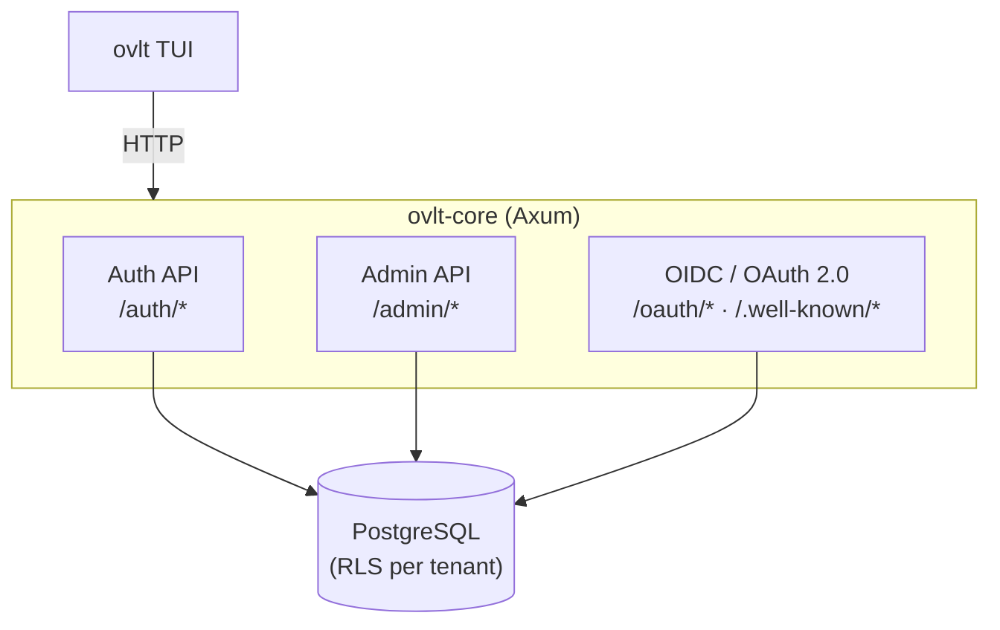
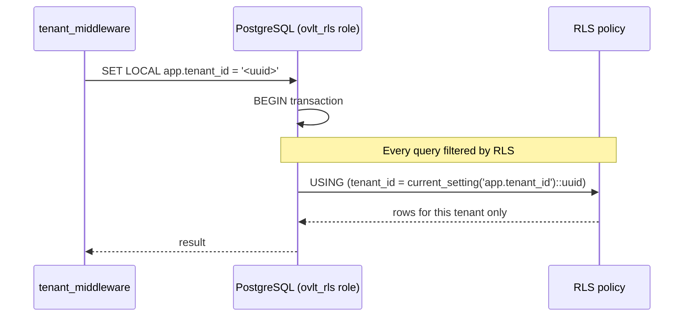
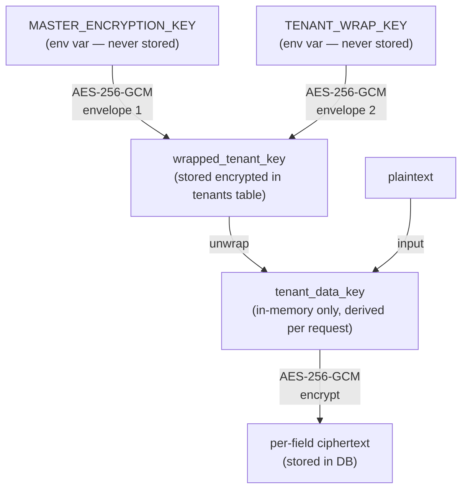
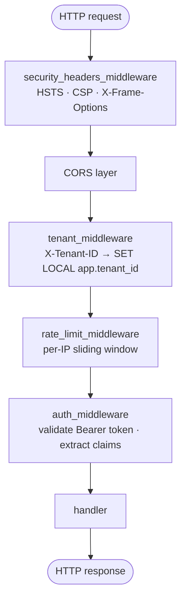

## Overview

OVLT is a single Rust binary (`ovlt-core`) built on Axum. It exposes three logical API surfaces over one HTTP server:

## Multi-tenancy

Each tenant is a row in the `tenants` table. Every data table (`users`, `clients`, `roles`, `sessions`, etc.) has a `tenant_id` column.

**PostgreSQL Row-Level Security (RLS)** enforces isolation at the database level, not the application level:

1. The application connects as role `ovlt_rls` (not a superuser)
2. On every request the middleware executes: `SET LOCAL app.tenant_id = '<uuid>'`
3. All tables carry an RLS policy: `USING (tenant_id = current_setting('app.tenant_id')::uuid)`
4. `FORCE ROW LEVEL SECURITY` prevents the table owner from bypassing it

<Note>
  Even a successful SQL injection running inside the application's DB session cannot read data from another tenant — the RLS policy returns zero rows before the data is visible.
</Note>

## Encryption model

OVLT uses **double-envelope AES-256-GCM** for sensitive fields (emails, TOTP secrets, SMTP passwords):

<Warning>
  Losing `MASTER_ENCRYPTION_KEY` or `TENANT_WRAP_KEY` makes all encrypted fields permanently unrecoverable. No recovery path exists.
</Warning>

## Token model

<AccordionGroup>
  <Accordion title="Access tokens (RS256 JWT)">
    - Short-lived (default 15 min, configurable via `JWT_EXPIRATION_MINUTES`)
    - Signed with RSA private key; consumers verify via the JWKS endpoint
    - Claims: `sub`, `iss`, `aud`, `exp`, `iat`, `jti`, `tenant_id`, `roles` (M2M only)
    - JTI tracked in DB — replayed or revoked tokens are rejected at introspection
  </Accordion>
  <Accordion title="Refresh tokens (opaque)">
    - Long-lived (default 30 days, configurable via `REFRESH_TOKEN_EXPIRATION_DAYS`)
    - Stored as a hash in DB — the plaintext is never persisted
    - Rotation on every use: each `/auth/refresh` call issues a new token and invalidates the old one
  </Accordion>
  <Accordion title="id_tokens (OIDC)">
    - Issued alongside access tokens in `authorization_code` flow
    - RS256 signed, includes standard OIDC claims (`email`, `name`, `sub`, etc.)
    - Verified via the same JWKS endpoint as access tokens
  </Accordion>
</AccordionGroup>

## Request lifecycle

Every HTTP request passes through this middleware stack in order:

## Background tasks

A Tokio task runs every 6 hours and purges expired rows:

- Expired refresh tokens
- Expired JTI replay-protection entries
- Stale login attempt records (lockout cleanup)
- Expired sessions

## Dependencies

| Crate | Purpose |
|-------|---------|
| `axum` | HTTP framework |
| `sea-orm` | ORM + migrations |
| `jsonwebtoken` | JWT encode/decode |
| `argon2` | Password hashing (Argon2id) |
| `hefesto` | AES-256-GCM double-envelope encryption |
| `totp-rs` | TOTP generation and verification |
| `ratatui` | Terminal UI (admin CLI) |
| `sysinfo` | Startup memory/CPU reporting |
