OVLT stores all data in PostgreSQL. You can connect directly with any SQL client for inspection, debugging, or manual queries.

<Warning>
  Direct database access bypasses Row-Level Security (RLS) when connecting as the `ovlt` superuser. Only use this for administration and debugging — never in application code.
</Warning>

## Connection details

| Field | Value |
|-------|-------|
| Driver | PostgreSQL |
| Host | See below |
| Port | `5432` |
| Database | `ovlt` |
| Username | `ovlt` |
| Password | `ovlt` (default in docker-compose) |

---

## Local setup

If you're running `docker compose up` on your own machine, PostgreSQL is exposed on `localhost:5432`.

<Steps>
  <Step title="Open your SQL client">
    In **DataGrip**: `New → Data Source → PostgreSQL`

    In **DBeaver**: `Database → New Database Connection → PostgreSQL`
  </Step>
  <Step title="Fill in the connection details">
    ```
    Host:     localhost
    Port:     5432
    Database: ovlt
    User:     ovlt
    Password: ovlt
    ```
  </Step>
  <Step title="Test the connection">
    Click **Test Connection**. If it fails, verify the container is running:

    ```bash
    docker ps | grep ovlt-postgres
    ```
  </Step>
</Steps>

---

## VPS / Remote server

PostgreSQL is not exposed to the internet by default — it only listens on the container's internal network. To connect remotely, use an **SSH tunnel**.

<Steps>
  <Step title="Open the SSH tunnel">
    Run this on your local machine. Replace `user` and `your-server-ip` with your SSH credentials:

    ```bash
    ssh -N -L 5432:localhost:5432 user@your-server-ip
    ```

    Keep this terminal open — the tunnel stays active while the command runs.

    <Tip>
      Add `-f` to run the tunnel in the background:
      ```bash
      ssh -f -N -L 5432:localhost:5432 user@your-server-ip
      ```
      To close it later: `pkill -f "ssh -f -N -L 5432"`
    </Tip>
  </Step>
  <Step title="Connect your SQL client to localhost">
    With the tunnel open, your SQL client connects to `localhost:5432` as if PostgreSQL were running locally:

    ```
    Host:     localhost
    Port:     5432
    Database: ovlt
    User:     ovlt
    Password: ovlt
    ```

    The tunnel forwards all traffic securely through SSH to the remote server.
  </Step>
</Steps>

<Note>
  If your server uses a non-standard SSH port, specify it with `-p`:
  ```bash
  ssh -N -L 5432:localhost:5432 -p 2222 user@your-server-ip
  ```
</Note>

---

## Schema diagram

```mermaid
erDiagram
    tenants {
        uuid id PK
        text slug
        text name
        text encryption_key "AES-256-GCM wrapped"
        text plan
        bool is_active
    }

    users {
        uuid id PK
        uuid tenant_id FK
        text email "AES-256-GCM encrypted"
        text email_lookup "HMAC hash — used for lookups"
        text password_hash "Argon2id"
        bool is_active
        bool email_verified
    }

    oauth_clients {
        uuid id PK
        uuid tenant_id FK
        text client_id
        text client_secret "hashed"
        text name
        bool is_confidential
        bool is_active
    }

    sessions {
        text id PK
        uuid tenant_id FK
        uuid user_id FK
        timestamptz expires_at
        timestamptz last_seen_at
    }

    refresh_tokens {
        uuid id PK
        uuid tenant_id FK
        uuid user_id FK
        text token_hash "SHA-256 — plaintext never stored"
        timestamptz expires_at
        timestamptz revoked_at
    }

    authorization_codes {
        text code PK
        uuid tenant_id FK
        text client_id FK
        uuid user_id FK
        text code_challenge "PKCE S256"
        timestamptz expires_at
        timestamptz used_at
    }

    roles {
        uuid id PK
        uuid tenant_id FK
        text name
        text description
    }

    permissions {
        uuid id PK
        uuid tenant_id FK
        text name
        text description
    }

    user_roles {
        uuid user_id FK
        uuid role_id FK
        uuid tenant_id FK
    }

    role_permissions {
        uuid role_id FK
        uuid permission_id FK
        uuid tenant_id FK
    }

    client_roles {
        uuid oauth_client_id FK
        uuid role_id FK
        uuid tenant_id FK
    }

    oauth_accounts {
        uuid id PK
        uuid tenant_id FK
        uuid user_id FK
        text provider
        text provider_user_id
    }

    identity_providers {
        uuid id PK
        uuid tenant_id FK
        text provider
        text client_id
        text client_secret_enc "AES-256-GCM encrypted"
        bool enabled
    }

    one_time_tokens {
        uuid id PK
        uuid tenant_id FK
        uuid user_id FK
        text token_hash "SHA-256"
        text token_type "verify_email | reset_password"
        timestamptz expires_at
        timestamptz used_at
    }

    totp_secrets {
        uuid id PK
        uuid tenant_id FK
        uuid user_id FK
        text secret_enc "AES-256-GCM encrypted"
        bool enabled
    }

    webauthn_credential {
        uuid id PK
        uuid tenant_id FK
        uuid user_id FK
        text credential_id
        text public_key_json
        text name
        int sign_count
    }

    tenant_settings {
        uuid tenant_id PK
        int lockout_max_attempts
        int lockout_window_minutes
        int lockout_duration_minutes
        int access_token_ttl_minutes
        int refresh_token_ttl_days
        bool allow_public_registration
        bool require_email_verified
    }

    password_policies {
        uuid tenant_id PK
        int min_length
        bool require_uppercase
        bool require_digit
        bool require_special
        int history_size
    }

    tenant_smtp_config {
        uuid tenant_id PK
        text host
        int port
        text username
        text password_enc "AES-256-GCM encrypted"
        bool enabled
    }

    login_attempts {
        uuid id PK
        uuid tenant_id
        text email_lookup
        timestamptz attempted_at
    }

    audit_log {
        uuid id PK
        uuid tenant_id
        uuid user_id
        text action
        text ip
        jsonb metadata
    }

    revoked_jtis {
        text jti PK
        timestamptz expires_at
    }

    rate_limit_buckets {
        text key PK "IP address"
        bigint window_start PK "floor(unix_ts / 60)"
        int count
        timestamptz expires_at
    }

    tenants             ||--o{ users               : "has"
    tenants             ||--o{ oauth_clients        : "has"
    tenants             ||--o{ roles                : "has"
    tenants             ||--o{ permissions          : "has"
    tenants             ||--o{ identity_providers   : "has"
    tenants             ||--o| tenant_settings      : "has"
    tenants             ||--o| password_policies    : "has"
    tenants             ||--o| tenant_smtp_config   : "has"

    users               ||--o{ sessions             : "has"
    users               ||--o{ refresh_tokens       : "has"
    users               ||--o{ user_roles           : "has"
    users               ||--o{ oauth_accounts       : "has"
    users               ||--o{ one_time_tokens      : "has"
    users               ||--o{ totp_secrets         : "has"
    users               ||--o{ webauthn_credential  : "has"
    users               ||--o{ authorization_codes  : "has"

    oauth_clients       ||--o{ authorization_codes  : "issues"
    oauth_clients       ||--o{ client_roles         : "has"

    roles               ||--o{ user_roles           : "assigned via"
    roles               ||--o{ client_roles         : "assigned via"
    roles               ||--o{ role_permissions     : "has"

    permissions         ||--o{ role_permissions     : "assigned via"
```



## Key tables

| Table | Description |
|-------|-------------|
| `tenants` | Tenant registry — one row per realm |
| `users` | Users per tenant. `email` is AES-256-GCM encrypted; use `email_lookup` (HMAC hash) for querying |
| `oauth_clients` | OAuth 2.0 clients per tenant |
| `sessions` | Active user sessions (browser SSO cookie sessions) |
| `refresh_tokens` | Hashed refresh tokens (plaintext never stored) |
| `roles` / `permissions` | RBAC definitions per tenant |
| `user_roles` | Role assignments per user |
| `client_roles` | Role assignments per OAuth client (M2M) |
| `role_permissions` | Permission assignments per role |
| `audit_log` | Auth event log (login, failures, registration) |
| `webauthn_credential` | Registered passkeys per user |
| `tenant_smtp_config` | Per-tenant SMTP — `password_enc` is encrypted |
| `one_time_tokens` | Email verification and password-reset tokens (hashed) |
| `totp_secrets` | TOTP secrets per user (encrypted) |
| `identity_providers` | Per-tenant social login config (Google, GitHub) |
| `authorization_codes` | OIDC authorization codes (PKCE S256, single-use) |
| `revoked_jtis` | Access token blocklist (JTI + expiry) |
| `login_attempts` | Per-tenant lockout tracking (keyed by email hash) |
| `rate_limit_buckets` | Distributed rate limit counters — PostgreSQL-backed, multi-replica safe |

---

## Useful queries

```sql
-- List all tenants
SELECT id, slug, name, plan, is_active, created_at FROM tenants;

-- Count users per tenant
SELECT t.slug, COUNT(u.id) AS users
FROM tenants t
LEFT JOIN users u ON u.tenant_id = t.id
GROUP BY t.slug;

-- Recent audit events
SELECT a.action, a.ip, a.created_at, t.slug AS tenant
FROM audit_log a
JOIN tenants t ON t.id = a.tenant_id
ORDER BY a.created_at DESC
LIMIT 50;

-- Active sessions
SELECT s.id, t.slug, s.created_at, s.last_seen_at, s.expires_at
FROM sessions s
JOIN tenants t ON t.id = s.tenant_id
WHERE s.expires_at > NOW()
ORDER BY s.last_seen_at DESC;

-- List passkeys
SELECT wc.name, wc.created_at, wc.last_used_at, t.slug
FROM webauthn_credentials wc
JOIN tenants t ON t.id = wc.tenant_id;
```

<Warning>
  Email addresses are stored encrypted (`email_enc`). You cannot read them directly from the database without the `MASTER_ENCRYPTION_KEY` and `TENANT_WRAP_KEY`. The `email_lookup` column is an HMAC hash used for lookups — it is not the email address.
</Warning>
