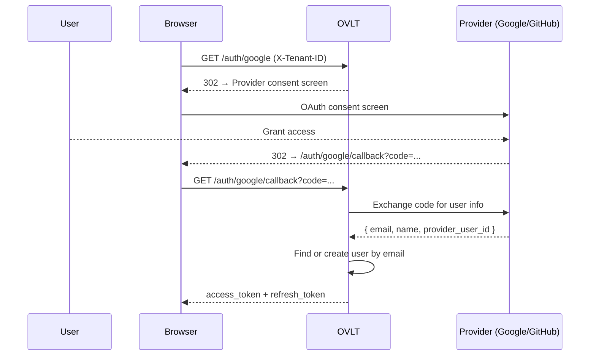

OVLT ships with built-in Google and GitHub OAuth providers. Social logins are per-tenant — each tenant can have its own provider credentials, or you can configure them globally via environment variables.

## How it works



Users authenticated via social login are stored in the `oauth_accounts` table linked to a `users` row. If a user with the same email already exists (from password auth), the OAuth account is linked to that user.

---

## Server configuration

<Tabs>
  <Tab title="Google">
    1. Go to [Google Cloud Console](https://console.cloud.google.com/) → APIs & Services → Credentials
    2. Create an **OAuth 2.0 Client ID** (Web application)
    3. Add your redirect URI: `https://your-domain/auth/google/callback`
    4. Set the environment variables:

    ```bash
    GOOGLE_CLIENT_ID=your-client-id.apps.googleusercontent.com
    GOOGLE_CLIENT_SECRET=your-client-secret
    GOOGLE_REDIRECT_URL=https://your-domain/auth/google/callback
    ```
  </Tab>
  <Tab title="GitHub">
    1. Go to GitHub → Settings → Developer settings → OAuth Apps → New OAuth App
    2. Set **Authorization callback URL**: `https://your-domain/auth/github/callback`
    3. Set the environment variables:

    ```bash
    GITHUB_CLIENT_ID=your-github-client-id
    GITHUB_CLIENT_SECRET=your-github-client-secret
    GITHUB_REDIRECT_URL=https://your-domain/auth/github/callback
    ```
  </Tab>
</Tabs>

<Note>
  If `GOOGLE_CLIENT_ID` / `GITHUB_CLIENT_ID` are not set, the respective provider is disabled and the `/auth/google` / `/auth/github` routes return 404.
</Note>

---

## Tenant-level providers (IdP)

Per-tenant provider credentials are configured in the TUI under the **IdP** tab, or via the admin API. These override the global environment variables for that tenant.

<Tabs>
  <Tab title="TUI">
    1. Select the tenant in the sidebar
    2. Navigate to the **IdP** tab
    3. Press `n` to add a provider
    4. Select provider type (Google / GitHub), enter:
       - Client ID
       - Client Secret
       - Redirect URL
       - Scopes (default: `openid email profile`)
    5. Toggle **Enabled** on
    6. Press `Enter` to save
  </Tab>
  <Tab title="API">
    ```bash
    curl -X POST http://localhost:3000/admin/identity-providers \
      -H "X-OVLT-Admin-Key: your-admin-key" \
      -H "X-OVLT-Tenant-ID: your-tenant-uuid" \
      -H "Content-Type: application/json" \
      -d '{
        "provider": "google",
        "client_id": "...",
        "client_secret": "...",
        "redirect_url": "https://your-domain/auth/google/callback",
        "scopes": "openid email profile",
        "enabled": true
      }'
    ```
  </Tab>
</Tabs>

---

## Initiating the flow

Your frontend redirects the user to the OVLT authorization endpoint:

```html
<!-- Google -->
<a href="https://your-ovlt/auth/google">Sign in with Google</a>

<!-- GitHub -->
<a href="https://your-ovlt/auth/github">Sign in with GitHub</a>
```

The `X-Tenant-ID` header must be set — either by your reverse proxy or by building the URL with a `tenant_id` query parameter if your setup supports it.

After a successful callback, OVLT redirects to your configured `redirect_url` with `access_token` and `refresh_token` as query parameters (or in the response body, depending on your flow).

---

## Account linking

| Scenario | Behavior |
|----------|----------|
| New email via social | New `users` row created; `oauth_accounts` row linked |
| Existing email (password auth) | OAuth account linked to existing user — same user, two login methods |
| Same provider, same email | Existing OAuth account updated (sign-in count, last seen) |

<Note>
  Email matching is case-insensitive and normalized before lookup. The email returned by the OAuth provider is used as-is for matching.
</Note>

---

## Scopes

Default scopes requested from each provider:

| Provider | Default scopes |
|----------|---------------|
| Google | `openid email profile` |
| GitHub | `read:user user:email` |

Custom scopes can be set per-tenant in the IdP configuration.
