OVLT supports FIDO2/WebAuthn Level 2 passkeys via the `webauthn-rs 0.4` crate. Passkeys are stored per-tenant in the `webauthn_credentials` table, fully isolated via PostgreSQL RLS, and work alongside password login — users can register one or more passkeys after their account exists.

<Note>
  WebAuthn relies on the browser's `navigator.credentials` API. It **cannot** be used from the CLI or the TUI. Users must register and authenticate passkeys through a browser-based UI that you build on top of OVLT's API.

```mermaid
sequenceDiagram
    participant U as User
    participant B as Browser
    participant O as OVLT
    participant A as Authenticator

    rect rgb(30, 40, 60)
        Note over B,A: Registration (requires existing login)
        B->>O: POST /auth/webauthn/register/start (JWT)
        O-->>B: CreationChallengeResponse
        B->>A: navigator.credentials.create(options)
        A-->>U: Touch / Face ID / PIN prompt
        U-->>A: confirm
        A-->>B: PublicKeyCredential
        B->>O: POST /auth/webauthn/register/finish
        O-->>B: { registered: true }
    end

    rect rgb(30, 60, 40)
        Note over B,A: Authentication (passwordless)
        B->>O: POST /auth/webauthn/authenticate/start { email }
        O-->>B: { challenge, token }
        B->>A: navigator.credentials.get(options)
        A-->>U: Touch / Face ID / PIN prompt
        U-->>A: confirm
        A-->>B: PublicKeyCredential
        B->>O: POST /auth/webauthn/authenticate/finish { token, credential }
        O-->>B: { access_token, refresh_token }
    end
```

</Note>



---

## Server configuration

The only required setting is `OVLT_ISSUER`. OVLT derives the WebAuthn **Relying Party ID (RP ID)** from its hostname automatically.

| `OVLT_ISSUER` value | Derived RP ID |
|---------------------|---------------|
| `http://localhost:3000` | `localhost` |
| `https://auth.example.com` | `auth.example.com` |
| `https://auth.example.com:8443` | `auth.example.com` |

Set this in your environment before starting the server:

```bash
OVLT_ISSUER=https://auth.example.com
```

The RP origin used for verification is the full `OVLT_ISSUER` value (scheme + host + optional port). Both the RP ID and origin must match exactly what the browser sees — mismatches cause authentication failures silently on the client side.

---

## Registration flow

A user must have a valid access token (from password login or social login) before they can register a passkey. Registration is a two-step round-trip.

<Steps>
  <Step title="Start registration — get a challenge from the server">
    Call `POST /auth/webauthn/register/start` with the user's access token. The server returns a `CreationChallengeResponse` — the options object you pass directly to `navigator.credentials.create()`.

    ```http
    POST /auth/webauthn/register/start
    Authorization: Bearer <access_token>
    X-Tenant-ID: <tenant_uuid>
    ```

    The server stores the challenge in memory keyed by user ID. It is valid for the duration of a single browser session.
  </Step>

  <Step title="Call navigator.credentials.create() in the browser">
    Pass the server's options to the WebAuthn browser API. The browser prompts the user to authenticate with their platform authenticator (Face ID, Touch ID, Windows Hello, hardware key, etc.).

    ```javascript
    async function registerPasskey(accessToken, tenantId, passkeyName) {
      // 1. Get challenge options from the server
      const startRes = await fetch('/auth/webauthn/register/start', {
        method: 'POST',
        headers: {
          'Authorization': `Bearer ${accessToken}`,
          'X-Tenant-ID': tenantId,
        },
      });

      if (!startRes.ok) throw new Error('Failed to start passkey registration');
      const options = await startRes.json();

      // 2. Decode base64url fields the browser expects as ArrayBuffers
      options.publicKey.challenge = base64urlToBuffer(options.publicKey.challenge);
      options.publicKey.user.id = base64urlToBuffer(options.publicKey.user.id);
      if (options.publicKey.excludeCredentials) {
        options.publicKey.excludeCredentials = options.publicKey.excludeCredentials.map(c => ({
          ...c,
          id: base64urlToBuffer(c.id),
        }));
      }

      // 3. Invoke the browser WebAuthn API
      const credential = await navigator.credentials.create(options);
      if (!credential) throw new Error('User cancelled passkey registration');

      // 4. Encode the credential response for JSON transport
      const credentialJSON = {
        id: credential.id,
        rawId: bufferToBase64url(credential.rawId),
        type: credential.type,
        response: {
          attestationObject: bufferToBase64url(credential.response.attestationObject),
          clientDataJSON: bufferToBase64url(credential.response.clientDataJSON),
        },
      };

      // 5. Finish registration — send credential back to the server
      const finishRes = await fetch('/auth/webauthn/register/finish', {
        method: 'POST',
        headers: {
          'Authorization': `Bearer ${accessToken}`,
          'X-Tenant-ID': tenantId,
          'Content-Type': 'application/json',
        },
        body: JSON.stringify({
          credential: credentialJSON,
          name: passkeyName ?? 'My passkey',  // optional display name
        }),
      });

      if (!finishRes.ok) throw new Error('Failed to save passkey');
      return await finishRes.json();
    }

    // Helpers
    function base64urlToBuffer(base64url) {
      const base64 = base64url.replace(/-/g, '+').replace(/_/g, '/');
      const binary = atob(base64);
      return Uint8Array.from(binary, c => c.charCodeAt(0)).buffer;
    }

    function bufferToBase64url(buffer) {
      return btoa(String.fromCharCode(...new Uint8Array(buffer)))
        .replace(/\+/g, '-').replace(/\//g, '_').replace(/=+$/, '');
    }
    ```
  </Step>

  <Step title="Verify server saved the passkey">
    A `200 OK` from `/auth/webauthn/register/finish` means the passkey is stored. The server records `credential_id`, `public_key_json`, `name`, `sign_count`, `created_at`, and `last_used_at` in `webauthn_credentials`.

    The user can now authenticate without a password on any device that has this passkey synced (iCloud Keychain, Google Password Manager, etc.) or via the hardware key it was created on.
  </Step>
</Steps>

---

## Authentication flow

Passkey authentication does not require a prior login — it returns the same token pair as `POST /auth/login`.

<Steps>
  <Step title="Start authentication — look up challenges for the user's passkeys">
    Provide the user's email so the server can find their registered credentials and issue a challenge scoped to them.

    ```http
    POST /auth/webauthn/authenticate/start
    X-Tenant-ID: <tenant_uuid>
    Content-Type: application/json

    { "email": "user@example.com" }
    ```

    Response:

    ```json
    {
      "challenge": { "publicKey": { ... } },
      "token": "chal_abcdef123456"
    }
    ```

    The `token` is a server-side reference to the in-memory challenge state. Pass it back in the finish step.
  </Step>

  <Step title="Call navigator.credentials.get() in the browser">
    ```javascript
    async function authenticateWithPasskey(email, tenantId) {
      // 1. Start — get allowed credentials and challenge
      const startRes = await fetch('/auth/webauthn/authenticate/start', {
        method: 'POST',
        headers: {
          'X-Tenant-ID': tenantId,
          'Content-Type': 'application/json',
        },
        body: JSON.stringify({ email }),
      });

      if (!startRes.ok) throw new Error('Failed to start passkey authentication');
      const { challenge: options, token } = await startRes.json();

      // 2. Decode base64url fields for the browser API
      options.publicKey.challenge = base64urlToBuffer(options.publicKey.challenge);
      if (options.publicKey.allowCredentials) {
        options.publicKey.allowCredentials = options.publicKey.allowCredentials.map(c => ({
          ...c,
          id: base64urlToBuffer(c.id),
        }));
      }

      // 3. Browser prompts the user to select and authenticate with a passkey
      const assertion = await navigator.credentials.get(options);
      if (!assertion) throw new Error('User cancelled passkey authentication');

      // 4. Encode the assertion for JSON transport
      const assertionJSON = {
        id: assertion.id,
        rawId: bufferToBase64url(assertion.rawId),
        type: assertion.type,
        response: {
          authenticatorData: bufferToBase64url(assertion.response.authenticatorData),
          clientDataJSON: bufferToBase64url(assertion.response.clientDataJSON),
          signature: bufferToBase64url(assertion.response.signature),
          userHandle: assertion.response.userHandle
            ? bufferToBase64url(assertion.response.userHandle)
            : null,
        },
      };

      // 5. Finish — verify assertion and exchange for tokens
      const finishRes = await fetch('/auth/webauthn/authenticate/finish', {
        method: 'POST',
        headers: {
          'X-Tenant-ID': tenantId,
          'Content-Type': 'application/json',
        },
        body: JSON.stringify({ token, credential: assertionJSON }),
      });

      if (!finishRes.ok) throw new Error('Passkey authentication failed');

      const { access_token, refresh_token, expires_in } = await finishRes.json();
      return { access_token, refresh_token, expires_in };
    }

    // Reuse the same base64url helpers from the registration example above
    ```
  </Step>

  <Step title="Store and use the returned tokens">
    The response is identical to `POST /auth/login`:

    ```json
    {
      "access_token": "eyJ...",
      "refresh_token": "...",
      "token_type": "Bearer",
      "expires_in": 900
    }
    ```

    Use these tokens exactly as you would tokens from password login. Refresh with `POST /auth/refresh`.
  </Step>
</Steps>

---

## Admin management

<Tabs>
  <Tab title="TUI">
    1. Open the **Users** tab for the target tenant.
    2. Select a user and press **Enter** or **e** to open the edit panel.
    3. Press **Tab** three times to reach the **Passkeys** section (field 4).
    4. Use **↑ / ↓** to navigate the list of registered passkeys.
    5. Press **d** to delete the selected passkey.

    Deleting a passkey is irreversible. The user will need to register a new one.
  </Tab>
  <Tab title="API">
    Both endpoints require `X-OVLT-Admin-Key` and `X-Tenant-ID`.

    **List passkeys for a user**

    ```http
    GET /admin/users/:id/passkeys
    X-OVLT-Admin-Key: <admin_key>
    X-Tenant-ID: <tenant_uuid>
    ```

    ```json
    [
      {
        "id": "cred_abc123",
        "name": "MacBook Touch ID",
        "aaguid": "adce0002-35bc-c60a-648b-0b25f1f05503",
        "sign_count": 42,
        "created_at": "2026-05-01T10:00:00Z",
        "last_used_at": "2026-05-06T08:30:00Z"
      }
    ]
    ```

    **Delete a passkey**

    ```http
    DELETE /admin/users/:id/passkeys/:cred_id
    X-OVLT-Admin-Key: <admin_key>
    X-Tenant-ID: <tenant_uuid>
    ```

    Returns `204 No Content` on success.
  </Tab>
</Tabs>

---

## Production notes

<Note type="warning">
  WebAuthn requires HTTPS in production. Browsers will refuse to call `navigator.credentials.create()` or `navigator.credentials.get()` on non-secure origins, with the sole exception of `localhost` (allowed for development).
</Note>

**RP ID and origin must be stable.** Once users have registered passkeys against an RP ID, that ID cannot change without invalidating all existing passkeys. Plan your domain before going to production.

- Set `OVLT_ISSUER` to your public HTTPS URL: `https://auth.yourdomain.com`
- The RP ID becomes `auth.yourdomain.com`
- The allowed origin is exactly `https://auth.yourdomain.com`
- If your app is on a subdomain (e.g., `app.yourdomain.com`), the WebAuthn calls must go through the OVLT origin or you must configure a custom RP ID — the default derivation will not cover cross-subdomain use

**Challenge state is in-memory.** The `DashMap` holding active challenges is not persisted and is lost on server restart. Users mid-registration or mid-authentication will need to restart the flow after a server restart. This is not a security concern — challenges are short-lived by design.

**Sign count.** OVLT stores the sign count inside the serialized `public_key_json` (single source of truth, as managed by `webauthn-rs`). A decreasing sign count is treated as a cloned authenticator signal and will cause authentication to fail.
